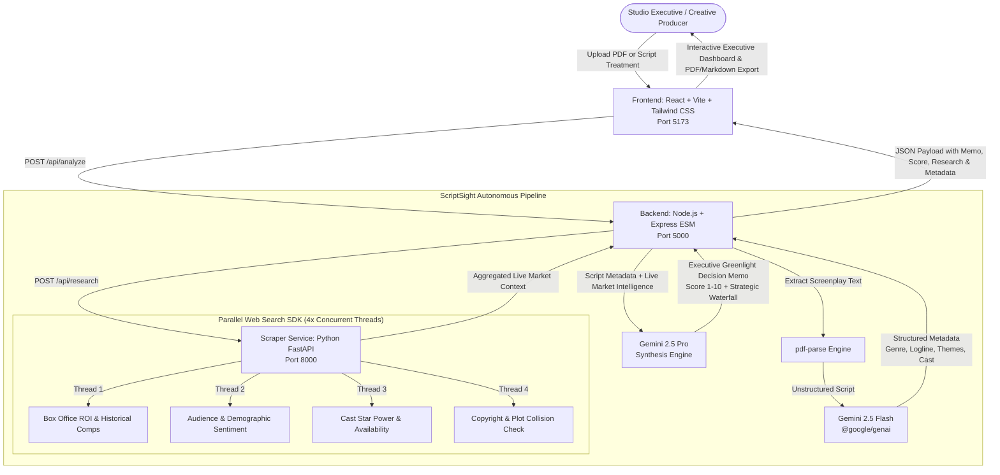

# ScriptSight 🎬
### Web-Scale Script & Franchise Intelligence Agent

[](LICENSE)
[](https://aistudio.google.com/)
[](https://parallel.ai/)
[](https://fastapi.tiangolo.com/)
[](https://expressjs.com/)
[](https://react.dev/)

**ScriptSight** is an autonomous AI agent and decision intelligence platform built for Hollywood studio executives, production companies, and creative agencies. It automates the end-to-end screenplay deconstruction and greenlight evaluation process by combining **Google Gemini 2.5** cognitive reasoning with multi-threaded live web market research powered by the **Parallel Web API/SDK**.

---

## 🌟 Key Capabilities

1. **Screenplay Ingestion & Multi-Format Support**:
   - Ingests screenplay PDF documents (`pdf-parse`) or raw text treatments/dialogue excerpts.
2. **AI Narrative Deconstruction (Gemini 2.5 Flash)**:
   - Deconstructs raw scripts into structured JSON metadata: genre comps, core logline, thematic tags, recommended talent wishlist, dramatic synopsis, tone descriptors, and budget tiers.
3. **Multi-Threaded Live Market Research (Parallel Web Search SDK)**:
   - Executes 4 concurrent live-web search tasks across crucial entertainment industry dimensions:
     - **Box Office ROI Benchmarks**: Historical comps, production budget ratios, and global theatrical grosses.
     - **Audience & Social Sentiment**: Real-time buzz, cultural resonance, and demographic alignment across Letterboxd, TikTok, and Reddit.
     - **Cast Track Record & Availability**: Box office opening power, international presales value, and scheduling availability.
     - **Plot & Trademark Clearance**: Screenplay registry checks, franchise collision scans, and IP originality verification.
4. **Executive Greenlight Decision Memo Synthesis (Gemini 2.5 Pro)**:
   - Synthesizes screenplay metadata and live market findings into an authoritative, publication-ready **Executive Greenlight Memo** with a normalized **Greenlight Score (1-10)**, financial risk analysis, and optimal release window recommendations.
5. **Studio-Grade Executive UI**:
   - Modern dark-mode interface styled in a luxury slate and amber color palette, featuring interactive score gauges, tabbed narrative breakdowns, one-click PDF/Markdown downloads, and sample studio presets.

---

## 🏛️ System Architecture



---

## 📁 Repository Structure

```
├── scraper_service/             # Python 3.11 + FastAPI + Parallel Web SDK
│   ├── main.py                  # FastAPI server & /api/research endpoint
│   ├── search_engine.py         # Multi-threaded Parallel search client with fallbacks
│   ├── pyproject.toml           # Ruff linter & formatter configuration
│   ├── requirements.txt         # FastAPI, Uvicorn, parallel-web, pydantic, ruff
│   ├── Dockerfile               # Production Docker container
│   └── .env.example             # PARALLEL_API_KEY template
│
├── backend/                     # Node.js (ESM) + Express + Google GenAI SDK
│   ├── server.js                # Express app, Multer file upload & CORS
│   ├── controllers/
│   │   └── analyzeController.js # Gemini Flash & Pro orchestration + scraper caller
│   ├── eslint.config.js         # ESLint 9 configuration
│   ├── .prettierrc              # Prettier code style config
│   ├── package.json             # @google/genai, @google/generative-ai, pdf-parse
│   ├── Dockerfile               # Production Docker container
│   └── .env.example             # GEMINI_API_KEY & SCRAPER_SERVICE_URL
│
├── frontend/                    # React 19 + Vite + Tailwind CSS
│   ├── src/
│   │   ├── components/
│   │   │   ├── Header.jsx           # Studio brand & live system indicators
│   │   │   ├── ScriptUploader.jsx   # Drag-and-drop PDF zone & preset picker
│   │   │   ├── AnalysisProgress.jsx # Animated 4-step pipeline tracker
│   │   │   └── ReportView.jsx       # Greenlight memo, score gauge & tabs
│   │   ├── App.jsx                  # Main application flow & API integration
│   │   ├── index.css                # Luxury dark-mode styling & typography
│   │   └── main.jsx                 # React root entry
│   ├── vite.config.js           # Vite + Tailwind CSS configuration
│   ├── package.json             # Axios, Lucide, React-Markdown, Tailwind
│   ├── Dockerfile               # Multi-stage Nginx container
│   └── .env.example             # VITE_API_URL template
│
├── docker-compose.yml           # Multi-service container orchestration
├── .env.example                 # Root environment variable template
├── LICENSE                      # MIT License
└── README.md                    # System documentation
```

---

## 🚀 Quickstart & Local Development

### Prerequisites
- **Node.js**: v18+ (v20+ recommended)
- **Python**: 3.11+
- **API Keys**:
  - [Google Gemini API Key](https://aistudio.google.com/) (`GEMINI_API_KEY`)
  - [Parallel API Key](https://parallel.ai/) (`PARALLEL_API_KEY`) *(Optional: system includes domain fallbacks if key is omitted)*

---

### Step 1: Clone and Configure Environment

```bash
# Clone the repository
git clone https://github.com/your-org/scriptsight.git
cd scriptsight

# Create root or service-specific .env files
cp .env.example .env
```

Set your keys in `.env` (or in each subservice directory):
```env
GEMINI_API_KEY=AIzaSy...
PARALLEL_API_KEY=par_...
```

---

### Step 2: Launch Microservices

#### 1. Start Scraper Service (Port 8000)
```bash
cd scraper_service
pip install -r requirements.txt
uvicorn main:app --host 0.0.0.0 --port 8000 --reload
```

#### 2. Start Backend Service (Port 5000)
```bash
cd backend
npm install
npm run dev
```

#### 3. Start Frontend UI (Port 5173)
```bash
cd frontend
npm install
npm run dev
```

Open **`http://localhost:5173`** in your browser.

---

## 🐳 Docker & Docker Compose

Run all three microservices simultaneously in isolated production containers:

```bash
# Build and start all services
docker compose up --build

# Run in background
docker compose up -d

# Stop services
docker compose down
```

The services will be accessible at:
- **Frontend**: `http://localhost:5173`
- **Backend**: `http://localhost:5000`
- **Scraper Service**: `http://localhost:8000`

---

## ⚡ Deploying to Vercel & Render

ScriptSight is architected for seamless cloud deployment:

### 1. Deploy Frontend on Vercel
1. Push your repository to GitHub.
2. Go to [vercel.com/new](https://vercel.com/new) and import the repository.
3. Configure the project settings:
   - **Root Directory**: `frontend`
   - **Framework Preset**: `Vite`
   - **Build Command**: `npm run build`
   - **Output Directory**: `dist`
4. Under **Environment Variables**, add:
   - `VITE_API_URL`: `https://your-backend-service-url.com` (from Step 2 below)
5. Click **Deploy**.

### 2. Deploy Backend & Scraper on Render (Free 1-Click Blueprint)
1. Go to [render.com](https://render.com) and click **New > Blueprint**.
2. Connect your GitHub repository. Render will automatically detect the root `render.yaml`.
3. Set your environment variables:
   - `GEMINI_API_KEY`: Your Google Gemini API Key
   - `PARALLEL_API_KEY`: Your Parallel API Key
4. Render will deploy both `scriptsight-scraper` and `scriptsight-backend`.
5. Copy your `scriptsight-backend` URL and paste it into your Vercel `VITE_API_URL` variable.

---

## ☁️ Google Cloud Run Deployment

Deploy each microservice to Google Cloud Run with autoscaling and zero server maintenance:

### 1. Set Google Cloud Environment Variables
```bash
export PROJECT_ID="your-gcp-project-id"
export REGION="us-central1"
gcloud config set project $PROJECT_ID
```

### 2. Deploy Scraper Service
```bash
cd scraper_service
gcloud builds submit --tag gcr.io/$PROJECT_ID/scriptsight-scraper:latest
gcloud run deploy scriptsight-scraper \
  --image gcr.io/$PROJECT_ID/scriptsight-scraper:latest \
  --platform managed \
  --region $REGION \
  --allow-unauthenticated \
  --set-env-vars PARALLEL_API_KEY="your_parallel_api_key"

# Save the outputted Scraper Service URL
SCRAPER_URL=$(gcloud run services describe scriptsight-scraper --platform managed --region $REGION --format 'value(status.url)')
```

### 3. Deploy Backend Service
```bash
cd ../backend
gcloud builds submit --tag gcr.io/$PROJECT_ID/scriptsight-backend:latest
gcloud run deploy scriptsight-backend \
  --image gcr.io/$PROJECT_ID/scriptsight-backend:latest \
  --platform managed \
  --region $REGION \
  --allow-unauthenticated \
  --set-env-vars GEMINI_API_KEY="your_gemini_api_key",SCRAPER_SERVICE_URL=$SCRAPER_URL

# Save the outputted Backend Service URL
BACKEND_URL=$(gcloud run services describe scriptsight-backend --platform managed --region $REGION --format 'value(status.url)')
```

### 4. Deploy Frontend Service
```bash
cd ../frontend
gcloud builds submit --tag gcr.io/$PROJECT_ID/scriptsight-frontend:latest
gcloud run deploy scriptsight-frontend \
  --image gcr.io/$PROJECT_ID/scriptsight-frontend:latest \
  --platform managed \
  --region $REGION \
  --allow-unauthenticated \
  --set-env-vars VITE_API_URL=$BACKEND_URL
```

---

## 📡 API Reference

### 1. `POST /api/analyze` (Backend Service)
Ingests screenplay files or text treatments and runs the complete analysis pipeline.

- **Content-Type**: `multipart/form-data` or `application/json`
- **Payload**:
  - Multipart: `file` (PDF/TXT/Fountain document)
  - JSON: `{ "scriptText": "Screenplay content..." }`
- **Response**:
```json
{
  "success": true,
  "data": {
    "title": "Neon Horizon: Protocol 7",
    "greenlightScore": 8.8,
    "verdict": "GREENLIGHT // FAST-TRACK PACKAGE",
    "metadata": {
      "genre": "Sci-Fi Cyberpunk Thriller",
      "logline": "...",
      "themes": ["Artificial Consciousness", "Class Divide"],
      "proposed_cast": ["Hiroyuki Sanada", "Florence Pugh"],
      "estimated_budget_tier": "$75M - $95M"
    },
    "research": {
      "box_office_benchmarks": { ... },
      "audience_sentiment": { ... },
      "cast_track_record": { ... },
      "ip_copyright_overlap": { ... }
    },
    "memo": "# EXECUTIVE GREENLIGHT DECISION MEMO\n...",
    "timestamp": "2026-09-03T00:00:00.000Z"
  }
}
```

### 2. `POST /api/research` (Scraper Service)
Executes 4 multi-threaded live web searches via the Parallel API.

- **Payload**:
```json
{
  "genre": "Sci-Fi Cyberpunk",
  "logline": "In a submerged 2088 Neo-Tokyo, an AI detective uncovers cloning conspiracy.",
  "themes": ["Artificial Consciousness", "Corporate Transhumanism"],
  "proposed_cast": ["Hiroyuki Sanada", "Rinko Kikuchi"]
}
```

---

## 🧪 Code Quality & Linting

```bash
# Scraper Service (Ruff)
cd scraper_service
ruff check .
ruff format .

# Backend (ESLint + Prettier)
cd ../backend
npm run lint
npm run format

# Frontend (ESLint + Prettier + Vite Build)
cd ../frontend
npm run lint
npm run build
```

---

## 📄 License

This project is licensed under the **MIT License** - see the [LICENSE](LICENSE) file for details.
